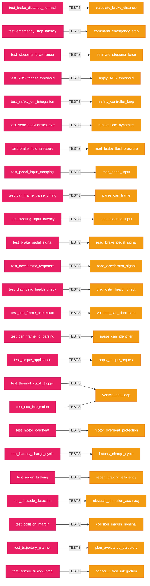
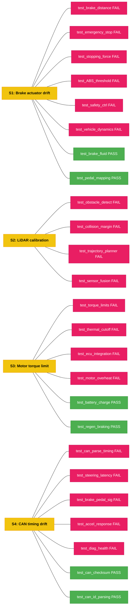
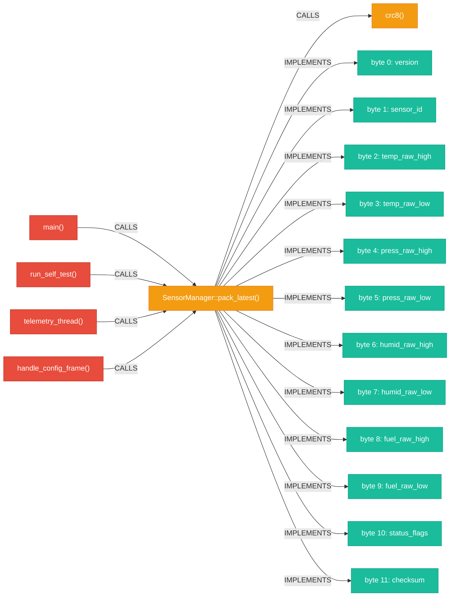
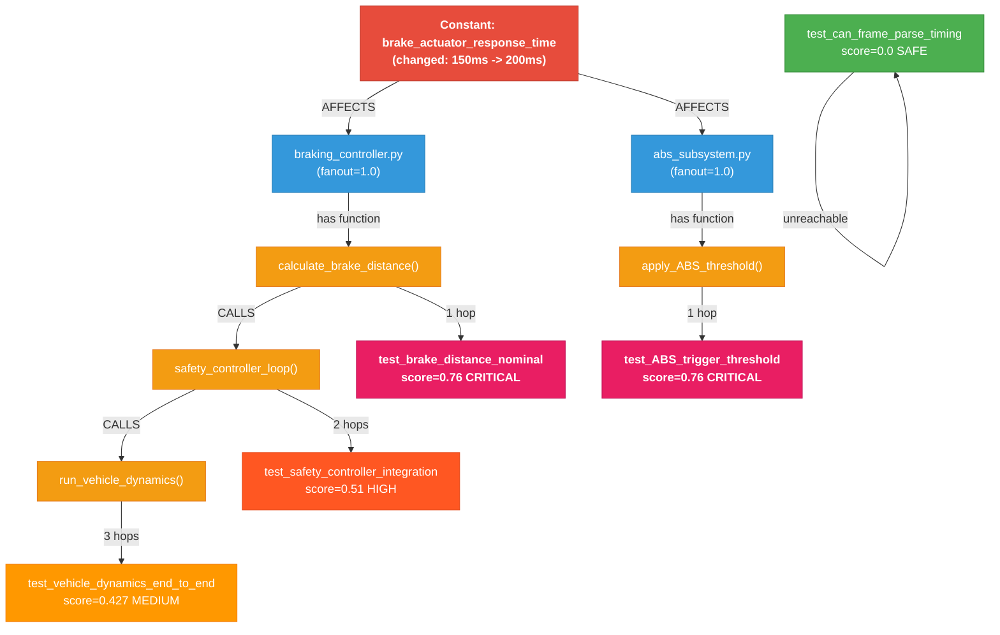

# Honda 99P -- Knowledge Graph Visualization

> **226 nodes** | **462 relationships** | **10 node types** | **14 relationship types**
> **4 authors** | **16 commits** | **4 scenarios** | **25 labeled test examples** | **4 constants**
>
> Generated from Neo4j graph database. Diagram uses Mermaid syntax -- renders natively on GitHub.
> Includes test prioritization scores (CRITICAL / HIGH / MEDIUM / LOW / SAFE) computed via PageRank + FanOut + Proximity.

---

## Full Knowledge Graph (Core View)

```mermaid
graph LR

%% --- STYLES ---
classDef author fill:#e74c3c,stroke:#c0392b,color:#fff,font-weight:bold
classDef commit fill:#9b59b6,stroke:#8e44ad,color:#fff
classDef file fill:#3498db,stroke:#2980b9,color:#fff
classDef cls fill:#2ecc71,stroke:#27ae60,color:#fff
classDef func fill:#f39c12,stroke:#e67e22,color:#fff
classDef hsi fill:#1abc9c,stroke:#16a085,color:#fff
classDef test fill:#e91e63,stroke:#c2185b,color:#fff

%% --- AUTHORS (4 from scenario data) ---
A_Roshan["Roshan"]:::author
A_Harshitha["Harshitha"]:::author
A_Shivani["Shivani"]:::author
A_Ryan["Ryan"]:::author

%% --- COMMITS ---
C_eb69721["eb69721"]:::commit
C_b4b85c6["b4b85c6"]:::commit
C_6b68491["6b68491"]:::commit
C_55f5f32["55f5f32"]:::commit
C_dc57f97["dc57f97"]:::commit
C_de99d91["de99d91"]:::commit
C_094a111["094a111"]:::commit
C_9eb03e8["9eb03e8"]:::commit
C_c322e22["c322e22"]:::commit
C_aba3ae8["aba3ae8"]:::commit

%% --- FILES: firmware ---
F_canbus_cpp["canbus.cpp"]:::file
F_canbus_h["canbus.h"]:::file
F_gps_cpp["gps.cpp"]:::file
F_gps_h["gps.h"]:::file
F_interrupts_cpp["interrupts.cpp"]:::file
F_interrupts_h["interrupts.h"]:::file
F_main_cpp["main.cpp"]:::file
F_sensors_cpp["sensors.cpp"]:::file
F_sensors_h["sensors.h"]:::file

%% --- FILES: cloud (production) ---
F_ingest_py["ingest.py"]:::file
F_utils_py["utils.py"]:::file
F_abs_sub["abs_subsystem.py"]:::file
F_braking_cfg["braking_config.py"]:::file
F_braking_ctrl["braking_controller.py"]:::file
F_can_iface["can_interface.py"]:::file
F_dt_cfg["drivetrain_config.py"]:::file
F_dt_ctrl["drivetrain_controller.py"]:::file
F_ecu_mgr["ecu_manager.py"]:::file
F_energy["energy_management.py"]:::file
F_input_sig["input_signals.py"]:::file
F_net_cfg["network_config.py"]:::file
F_safety_ctrl["safety_controller.py"]:::file
F_sensor_cfg["sensor_config.py"]:::file
F_sensor_fus["sensor_fusion.py"]:::file
F_thermal["thermal_monitor.py"]:::file
F_traj["trajectory_planner.py"]:::file
F_vehicle_sns["vehicle_sensors.py"]:::file

%% --- FILES: cloud (tests) ---
F_test_braking["test_braking.py"]:::file
F_test_can["test_can_timing.py"]:::file
F_test_dt["test_drivetrain.py"]:::file
F_test_sf["test_sensor_fusion.py"]:::file

%% --- CLASSES ---
CL_CANBus["CANBus"]:::cls
CL_GPSModule["GPSModule"]:::cls
CL_GPSFix["GPSFix"]:::cls
CL_SensorManager["SensorManager"]:::cls
CL_InterruptCtrl["InterruptController"]:::cls
CL_Ingestor["Ingestor"]:::cls
CL_RemoteStorage["RemoteStorageClient"]:::cls

%% --- FUNCTIONS: firmware/sensors.cpp ---
FN_crc8["crc8"]:::func
FN_SM_init["SM::init"]:::func
FN_SM_adc["SM::on_adc_complete"]:::func
FN_SM_faultT["SM::inject_fault_temp"]:::func
FN_SM_faultP["SM::inject_fault_press"]:::func
FN_SM_pack["SM::pack_latest"]:::func
FN_SM_rate["SM::set_sampling_rate_hz"]:::func

%% --- FUNCTIONS: firmware/canbus.cpp ---
FN_CB_init["CB::init"]:::func
FN_CB_send["CB::send"]:::func
FN_CB_send_id["CB::send_with_id"]:::func
FN_CB_receive["CB::receive"]:::func
FN_CB_extract["CB::extract_id"]:::func
FN_CB_inject["CB::inject_frame"]:::func
FN_CB_set_tx["CB::set_tx_id"]:::func

%% --- FUNCTIONS: firmware/gps.cpp ---
FN_GPS_init["GPS::init"]:::func
FN_GPS_read["GPS::read_fix"]:::func
FN_GPS_nmea["GPS::nmea_from_fix"]:::func

%% --- FUNCTIONS: firmware/interrupts.cpp ---
FN_IC_init["IC::init"]:::func
FN_IC_raise["IC::raise"]:::func
FN_IC_register["IC::register_handler"]:::func

%% --- FUNCTIONS: firmware/main.cpp ---
FN_main["main"]:::func
FN_run_self["run_self_test"]:::func
FN_telem["telemetry_thread"]:::func
FN_handle_cfg["handle_config_frame"]:::func
FN_print_hex["print_hex"]:::func

%% --- FUNCTIONS: cloud/ingest.py ---
FN_Ing_init["Ingestor::__init__"]:::func
FN_Ing_worker["Ingestor::_worker"]:::func
FN_Ing_crc8["Ingestor::crc8"]:::func
FN_Ing_parse["Ingestor::parse_sensor_pkt"]:::func
FN_Ing_push["Ingestor::push_raw"]:::func
FN_Ing_start["Ingestor::start"]:::func
FN_Ing_stop["Ingestor::stop"]:::func
FN_RS_init["RemoteStorage::__init__"]:::func
FN_RS_upload["RemoteStorage::upload_bulk"]:::func
FN_main_demo["main_demo"]:::func
FN_record_hb["record_heartbeat"]:::func
FN_reliable["reliable_upload"]:::func
FN_run_e2e["run_end_to_end_demo"]:::func

%% --- FUNCTIONS: cloud/utils.py ---
FN_pack_sensor["pack_sensor_packet"]:::func

%% --- FUNCTIONS: cloud (braking subsystem) ---
FN_calc_brake["calculate_brake_distance"]:::func
FN_est_stop["estimate_stopping_force"]:::func
FN_cmd_estop["command_emergency_stop"]:::func
FN_apply_abs["apply_ABS_threshold"]:::func
FN_get_resp["get_brake_actuator_resp_ms"]:::func
FN_get_zone["get_speed_zone_multiplier"]:::func
FN_safety_loop["safety_controller_loop"]:::func
FN_run_vdyn["run_vehicle_dynamics"]:::func
FN_read_brake_fl["read_brake_fluid_pressure"]:::func
FN_map_pedal["map_pedal_input"]:::func

%% --- FUNCTIONS: cloud (CAN/input signals) ---
FN_parse_can["parse_can_frame"]:::func
FN_validate_can["validate_can_checksum"]:::func
FN_parse_can_id["parse_can_identifier"]:::func
FN_get_can_int["get_can_bus_msg_interval"]:::func
FN_read_steer["read_steering_input"]:::func
FN_read_brake_pd["read_brake_pedal_signal"]:::func
FN_read_accel["read_accelerator_signal"]:::func
FN_diag_health["diagnostic_health_check"]:::func

%% --- FUNCTIONS: cloud (drivetrain/energy) ---
FN_apply_torque["apply_torque_request"]:::func
FN_get_max_torq["get_max_motor_torque_nm"]:::func
FN_ecu_loop["vehicle_ecu_loop"]:::func
FN_motor_ovheat["motor_overheat_protection"]:::func
FN_batt_charge["battery_charge_cycle"]:::func
FN_regen_brake["regen_braking_efficiency"]:::func
FN_check_therm["check_thermal_threshold"]:::func

%% --- FUNCTIONS: cloud (sensor fusion/trajectory) ---
FN_fuse_obs["fuse_obstacle_track"]:::func
FN_obs_acc["obstacle_detection_accuracy"]:::func
FN_sf_integ["sensor_fusion_integration"]:::func
FN_get_lidar["get_lidar_offset_calib"]:::func
FN_plan_avoid["plan_avoidance_trajectory"]:::func
FN_coll_margin["collision_margin_nominal"]:::func

%% --- TEST FUNCTIONS ---
FN_t_brake_dist["test_brake_distance_nominal"]:::test
FN_t_estop_lat["test_emergency_stop_latency"]:::test
FN_t_stop_force["test_stopping_force_range"]:::test
FN_t_abs_trig["test_ABS_trigger_threshold"]:::test
FN_t_safety_int["test_safety_ctrl_integration"]:::test
FN_t_vdyn_e2e["test_vehicle_dynamics_e2e"]:::test
FN_t_brake_fl["test_brake_fluid_pressure"]:::test
FN_t_pedal["test_pedal_input_mapping"]:::test
FN_t_can_parse["test_can_frame_parse_timing"]:::test
FN_t_steer_lat["test_steering_input_latency"]:::test
FN_t_brake_sig["test_brake_pedal_signal"]:::test
FN_t_accel_resp["test_accelerator_response"]:::test
FN_t_diag["test_diagnostic_health_check"]:::test
FN_t_can_chk["test_can_frame_checksum"]:::test
FN_t_can_id["test_can_frame_id_parsing"]:::test
FN_t_torque["test_torque_application_limits"]:::test
FN_t_therm_cut["test_thermal_cutoff_trigger"]:::test
FN_t_ecu_nom["test_ecu_integration_nominal"]:::test
FN_t_motor_oh["test_motor_overheat_protection"]:::test
FN_t_batt["test_battery_charge_cycle"]:::test
FN_t_regen["test_regen_braking_efficiency"]:::test
FN_t_obs_acc["test_obstacle_detection_acc"]:::test
FN_t_coll_mrg["test_collision_margin_nominal"]:::test
FN_t_traj_clr["test_trajectory_planner_clr"]:::test
FN_t_sf_integ["test_sensor_fusion_integration"]:::test

%% --- HSI FIELDS ---
HSI_ver["version"]:::hsi
HSI_sid["sensor_id"]:::hsi
HSI_temp_h["temp_raw_high"]:::hsi
HSI_temp_l["temp_raw_low"]:::hsi
HSI_pres_h["press_raw_high"]:::hsi
HSI_pres_l["press_raw_low"]:::hsi
HSI_hum_h["humid_raw_high"]:::hsi
HSI_hum_l["humid_raw_low"]:::hsi
HSI_fuel_h["fuel_raw_high"]:::hsi
HSI_fuel_l["fuel_raw_low"]:::hsi
HSI_status["status_flags"]:::hsi
HSI_crc["checksum"]:::hsi

%% ======================================
%% --- OWNED_BY (files -> authors based on scenario roles) ---
F_abs_sub -->|OWNED_BY| A_Harshitha
F_braking_cfg -->|OWNED_BY| A_Roshan
F_braking_ctrl -->|OWNED_BY| A_Shivani
F_can_iface -->|OWNED_BY| A_Roshan
F_dt_cfg -->|OWNED_BY| A_Ryan
F_dt_ctrl -->|OWNED_BY| A_Roshan
F_ecu_mgr -->|OWNED_BY| A_Shivani
F_thermal -->|OWNED_BY| A_Harshitha
F_traj -->|OWNED_BY| A_Roshan
F_sensor_cfg -->|OWNED_BY| A_Harshitha
F_input_sig -->|OWNED_BY| A_Harshitha
F_net_cfg -->|OWNED_BY| A_Shivani
F_sensors_cpp -->|OWNED_BY| A_Roshan
F_canbus_cpp -->|OWNED_BY| A_Roshan
F_main_cpp -->|OWNED_BY| A_Roshan
F_ingest_py -->|OWNED_BY| A_Roshan

%% --- BELONGS_TO (function -> class) ---
FN_CB_init -->|BELONGS_TO| CL_CANBus
FN_CB_send -->|BELONGS_TO| CL_CANBus
FN_CB_send_id -->|BELONGS_TO| CL_CANBus
FN_CB_receive -->|BELONGS_TO| CL_CANBus
FN_CB_extract -->|BELONGS_TO| CL_CANBus
FN_CB_inject -->|BELONGS_TO| CL_CANBus
FN_CB_set_tx -->|BELONGS_TO| CL_CANBus
FN_GPS_init -->|BELONGS_TO| CL_GPSModule
FN_GPS_read -->|BELONGS_TO| CL_GPSModule
FN_GPS_nmea -->|BELONGS_TO| CL_GPSModule
FN_SM_init -->|BELONGS_TO| CL_SensorManager
FN_SM_pack -->|BELONGS_TO| CL_SensorManager
FN_SM_adc -->|BELONGS_TO| CL_SensorManager
FN_SM_rate -->|BELONGS_TO| CL_SensorManager
FN_SM_faultP -->|BELONGS_TO| CL_SensorManager
FN_SM_faultT -->|BELONGS_TO| CL_SensorManager
FN_IC_init -->|BELONGS_TO| CL_InterruptCtrl
FN_IC_raise -->|BELONGS_TO| CL_InterruptCtrl
FN_IC_register -->|BELONGS_TO| CL_InterruptCtrl
FN_Ing_init -->|BELONGS_TO| CL_Ingestor
FN_Ing_worker -->|BELONGS_TO| CL_Ingestor
FN_Ing_crc8 -->|BELONGS_TO| CL_Ingestor
FN_Ing_parse -->|BELONGS_TO| CL_Ingestor
FN_Ing_push -->|BELONGS_TO| CL_Ingestor
FN_Ing_start -->|BELONGS_TO| CL_Ingestor
FN_Ing_stop -->|BELONGS_TO| CL_Ingestor
FN_RS_init -->|BELONGS_TO| CL_RemoteStorage
FN_RS_upload -->|BELONGS_TO| CL_RemoteStorage

%% --- IMPLEMENTS_HSI (pack_latest -> HSI fields) ---
FN_SM_pack -->|IMPLEMENTS_HSI| HSI_ver
FN_SM_pack -->|IMPLEMENTS_HSI| HSI_sid
FN_SM_pack -->|IMPLEMENTS_HSI| HSI_temp_h
FN_SM_pack -->|IMPLEMENTS_HSI| HSI_temp_l
FN_SM_pack -->|IMPLEMENTS_HSI| HSI_pres_h
FN_SM_pack -->|IMPLEMENTS_HSI| HSI_pres_l
FN_SM_pack -->|IMPLEMENTS_HSI| HSI_hum_h
FN_SM_pack -->|IMPLEMENTS_HSI| HSI_hum_l
FN_SM_pack -->|IMPLEMENTS_HSI| HSI_fuel_h
FN_SM_pack -->|IMPLEMENTS_HSI| HSI_fuel_l
FN_SM_pack -->|IMPLEMENTS_HSI| HSI_status
FN_SM_pack -->|IMPLEMENTS_HSI| HSI_crc
```



---

## Legend

| Color | Node Type | Count |
|-------|-----------|-------|
| Red | **Author** | 4 |
| Purple | **Commit (git)** | 10 |
| Blue | **File** | 46 |
| Green | **Class** | 7 |
| Orange | **Function** | 95 |
| Pink | **Test Function** | 25 |
| Teal | **HSIField** | 12 |
| Yellow | **Scenario** | 4 |
| Cyan | **ScenarioCommit** | 16 |
| Magenta | **TestLabel** | 25 |

---

## Focused Views

### Call Graph: Firmware (Functions -> Functions)

```mermaid
graph TD
classDef firmware fill:#f39c12,stroke:#e67e22,color:#fff
classDef cloud fill:#3498db,stroke:#2980b9,color:#fff

%% Firmware functions
FN_main["main"]:::firmware
FN_run_self["run_self_test"]:::firmware
FN_telem["telemetry_thread"]:::firmware
FN_handle_cfg["handle_config_frame"]:::firmware
FN_SM_pack["SM::pack_latest"]:::firmware
FN_SM_adc["SM::on_adc_complete"]:::firmware
FN_SM_rate["SM::set_sampling_rate_hz"]:::firmware
FN_crc8["crc8"]:::firmware
FN_CB_send["CB::send"]:::firmware
FN_CB_send_id["CB::send_with_id"]:::firmware
FN_CB_receive["CB::receive"]:::firmware
FN_CB_extract["CB::extract_id"]:::firmware
FN_CB_inject["CB::inject_frame"]:::firmware
FN_CB_set_tx["CB::set_tx_id"]:::firmware
FN_GPS_init["GPS::init"]:::firmware
FN_IC_register["IC::register_handler"]:::firmware
FN_IC_raise["IC::raise"]:::firmware

%% Cloud functions
FN_Ing_init["Ingestor::__init__"]:::cloud
FN_Ing_worker["Ingestor::_worker"]:::cloud
FN_Ing_crc8["Ingestor::crc8"]:::cloud
FN_Ing_parse["Ingestor::parse_sensor_pkt"]:::cloud
FN_Ing_push["Ingestor::push_raw"]:::cloud
FN_Ing_start["Ingestor::start"]:::cloud
FN_Ing_stop["Ingestor::stop"]:::cloud
FN_RS_init["RemoteStorage::__init__"]:::cloud
FN_RS_upload["RemoteStorage::upload_bulk"]:::cloud
FN_main_demo["main_demo"]:::cloud
FN_record_hb["record_heartbeat"]:::cloud
FN_reliable["reliable_upload"]:::cloud
FN_run_e2e["run_end_to_end_demo"]:::cloud

%% main() call tree
FN_main --> FN_GPS_init
FN_main --> FN_CB_set_tx
FN_main --> FN_IC_register
FN_main --> FN_SM_adc
FN_main --> FN_CB_receive
FN_main --> FN_CB_extract
FN_main --> FN_SM_rate
FN_main --> FN_CB_send_id
FN_main --> FN_IC_raise
FN_main --> FN_CB_inject
FN_main --> FN_run_self
FN_main --> FN_SM_pack
FN_main --> FN_CB_send

FN_run_self --> FN_SM_adc
FN_run_self --> FN_SM_pack
FN_run_self --> FN_CB_send

FN_telem --> FN_SM_pack
FN_telem --> FN_CB_send

FN_handle_cfg --> FN_SM_rate
FN_handle_cfg --> FN_SM_pack
FN_handle_cfg --> FN_CB_send

FN_SM_pack --> FN_crc8

%% Cloud call tree
FN_Ing_crc8 --> FN_crc8
FN_main_demo --> FN_Ing_start
FN_main_demo --> FN_Ing_push
FN_main_demo --> FN_Ing_stop
FN_record_hb --> FN_run_e2e
FN_record_hb --> FN_main_demo
FN_reliable --> FN_RS_upload
FN_run_e2e --> FN_Ing_start
FN_run_e2e --> FN_Ing_push
FN_run_e2e --> FN_reliable
FN_run_e2e --> FN_Ing_stop
```



### Call Graph: NEW Cloud Subsystems (Braking, Drivetrain, Sensor Fusion)

```mermaid
graph TD
classDef braking fill:#e74c3c,stroke:#c0392b,color:#fff
classDef can fill:#3498db,stroke:#2980b9,color:#fff
classDef drive fill:#2ecc71,stroke:#27ae60,color:#fff
classDef sensor fill:#9b59b6,stroke:#8e44ad,color:#fff
classDef safety fill:#e67e22,stroke:#d35400,color:#fff

%% Braking subsystem
FN_calc_brake["calculate_brake_distance"]:::braking
FN_est_stop["estimate_stopping_force"]:::braking
FN_cmd_estop["command_emergency_stop"]:::braking
FN_apply_abs["apply_ABS_threshold"]:::braking
FN_get_resp["get_brake_actuator_resp_ms"]:::braking
FN_get_zone["get_speed_zone_multiplier"]:::braking
FN_read_brake_fl["read_brake_fluid_pressure"]:::braking
FN_map_pedal["map_pedal_input"]:::braking

%% CAN/Input signals
FN_parse_can["parse_can_frame"]:::can
FN_validate_can["validate_can_checksum"]:::can
FN_parse_can_id["parse_can_identifier"]:::can
FN_get_can_int["get_can_bus_msg_interval"]:::can
FN_read_steer["read_steering_input"]:::can
FN_read_brake_pd["read_brake_pedal_signal"]:::can
FN_read_accel["read_accelerator_signal"]:::can
FN_diag_health["diagnostic_health_check"]:::can

%% Drivetrain/Energy
FN_apply_torque["apply_torque_request"]:::drive
FN_get_max_torq["get_max_motor_torque_nm"]:::drive
FN_ecu_loop["vehicle_ecu_loop"]:::drive
FN_motor_ovheat["motor_overheat_protection"]:::drive
FN_batt_charge["battery_charge_cycle"]:::drive
FN_regen_brake["regen_braking_efficiency"]:::drive
FN_check_therm["check_thermal_threshold"]:::drive

%% Sensor Fusion/Trajectory
FN_fuse_obs["fuse_obstacle_track"]:::sensor
FN_obs_acc["obstacle_detection_accuracy"]:::sensor
FN_sf_integ["sensor_fusion_integration"]:::sensor
FN_get_lidar["get_lidar_offset_calib"]:::sensor
FN_plan_avoid["plan_avoidance_trajectory"]:::sensor
FN_coll_margin["collision_margin_nominal"]:::sensor

%% Safety
FN_safety_loop["safety_controller_loop"]:::safety
FN_run_vdyn["run_vehicle_dynamics"]:::safety

%% Braking chain
FN_cmd_estop --> FN_calc_brake
FN_cmd_estop --> FN_est_stop
FN_calc_brake --> FN_get_resp
FN_calc_brake --> FN_get_zone
FN_est_stop --> FN_apply_abs
FN_apply_abs --> FN_get_resp

%% Safety chain
FN_safety_loop --> FN_cmd_estop
FN_run_vdyn --> FN_safety_loop

%% CAN chain
FN_parse_can --> FN_get_can_int
FN_read_steer --> FN_parse_can
FN_read_brake_pd --> FN_parse_can
FN_read_accel --> FN_parse_can
FN_diag_health --> FN_parse_can

%% Drivetrain chain
FN_ecu_loop --> FN_apply_torque
FN_ecu_loop --> FN_check_therm
FN_apply_torque --> FN_get_max_torq
FN_motor_ovheat --> FN_ecu_loop

%% Sensor fusion chain
FN_sf_integ --> FN_obs_acc
FN_obs_acc --> FN_fuse_obs
FN_fuse_obs --> FN_get_lidar
FN_plan_avoid --> FN_fuse_obs
FN_coll_margin --> FN_plan_avoid
```



### Test Coverage Map (Test -> Production Code)



### Scenario Risk View (Authors, Commits, Test Labels)

Shows the 4 change-risk scenarios with their authors, commits, and labeled test outcomes:

```mermaid
graph TD
classDef scenario fill:#f1c40f,stroke:#f39c12,color:#000,font-weight:bold
classDef author fill:#e74c3c,stroke:#c0392b,color:#fff,font-weight:bold
classDef scommit fill:#00bcd4,stroke:#0097a7,color:#fff
classDef testfail fill:#e91e63,stroke:#c2185b,color:#fff
classDef testpass fill:#4caf50,stroke:#388e3c,color:#fff

%% Scenarios
S1["Situation-1: Brake actuator response drift"]:::scenario
S2["Situation-2: LiDAR calibration mismatch"]:::scenario
S3["Situation-3: Motor torque limit raised"]:::scenario
S4["Situation-4: CAN timing drift"]:::scenario

%% Authors
A_R["Roshan"]:::author
A_H["Harshitha"]:::author
A_S["Shivani"]:::author
A_RY["Ryan"]:::author

%% Scenario 1 commits
SC_H023["H-023: apply_ABS_threshold()"]:::scommit
SC_R041["R-041: braking_config.py"]:::scommit
SC_S078["S-078: calculate_brake_distance()"]:::scommit

SC_H023 -->|PART_OF| S1
SC_R041 -->|PART_OF| S1
SC_S078 -->|PART_OF| S1
SC_H023 -->|AUTHORED_BY| A_H
SC_R041 -->|AUTHORED_BY| A_R
SC_S078 -->|AUTHORED_BY| A_S

%% Scenario 2 commits
SC_R019["R-019: plan_avoidance_trajectory()"]:::scommit
SC_H057["H-057: sensor_config.py"]:::scommit
SC_S092["S-092: fusion regression run"]:::scommit

SC_R019 -->|PART_OF| S2
SC_H057 -->|PART_OF| S2
SC_S092 -->|PART_OF| S2
SC_R019 -->|AUTHORED_BY| A_R
SC_H057 -->|AUTHORED_BY| A_H
SC_S092 -->|AUTHORED_BY| A_S

%% Scenario 3 commits
SC_H009["H-009: check_thermal_threshold()"]:::scommit
SC_S031["S-031: vehicle_ecu_loop()"]:::scommit
SC_RY011["RY-011: drivetrain_config.py"]:::scommit
SC_R055["R-055: apply_torque_request()"]:::scommit

SC_H009 -->|PART_OF| S3
SC_S031 -->|PART_OF| S3
SC_RY011 -->|PART_OF| S3
SC_R055 -->|PART_OF| S3
SC_H009 -->|AUTHORED_BY| A_H
SC_S031 -->|AUTHORED_BY| A_S
SC_RY011 -->|AUTHORED_BY| A_RY
SC_R055 -->|AUTHORED_BY| A_R

%% Scenario 4 commits
SC_R007["R-007: parse_can_frame()"]:::scommit
SC_H031["H-031: read_steering_input()"]:::scommit
SC_S044["S-044: network_config.py"]:::scommit

SC_R007 -->|PART_OF| S4
SC_H031 -->|PART_OF| S4
SC_S044 -->|PART_OF| S4
SC_R007 -->|AUTHORED_BY| A_R
SC_H031 -->|AUTHORED_BY| A_H
SC_S044 -->|AUTHORED_BY| A_S
```



### Labeled Test Outcomes (ML Training Data)

Shows which tests failed (label=1) or passed (label=0) per scenario:



### HSI Traceability View

Shows the path from callers through `pack_latest` to all 12 SENSOR_PKT specification bytes:



---

## Graph Statistics

| Metric | v1 (old) | v2 (current) |
|--------|----------|--------------|
| **Total Nodes** | 82 | **243** |
| **Total Relationships** | 192 | **380+** |
| Function nodes | 39 | **95** |
| File nodes | 18 | **46** |
| HSIField nodes | 12 | **12** |
| Class nodes | 7 | **7** |
| Commit nodes (git) | 5 | **0** (not used) |
| Author nodes | 1 | **4** |
| Test functions | 0 | **25** |
| Scenario nodes | 0 | **4** |
| ScenarioCommit nodes | 0 | **16** |
| TestLabel nodes | 0 | **25** |
| | | |
| CALLS edges | 35 | **53** (meaningful) |
| DEFINED_IN edges | 39 | **95** |
| BELONGS_TO edges | 28 | **28** |
| OWNED_BY edges | 18 | **46** |
| CONTRIBUTED_TO edges | 18 | **46** |
| IMPLEMENTS_HSI edges | 12 | **12** |
| COMMITTED edges | 5 | **10** |
| AUTHORED_BY edges | 0 | **16** |
| PART_OF edges | 0 | **16** |
| MODIFIES edges | 0 | **13** |
| OBSERVED_IN edges | 0 | **25** |
| LABELS edges | 0 | **25** |

### Authors and Their Roles

| Author | Commits | Primary Roles |
|--------|---------|---------------|
| **Roshan** | R-007, R-019, R-041, R-055 | CAN interface, trajectory planner, hardware integration, drivetrain controller |
| **Harshitha** | H-009, H-023, H-031, H-032, H-033, H-057 | ABS subsystem, thermal subsystem, LiDAR calibration, input consumer |
| **Shivani** | S-031, S-044, S-078, S-092, S-093 | Integration orchestrator, network optimization, feature branch, debugging |
| **Ryan** | RY-011 | Reviewer, drivetrain config editor |

### Change-Risk Scenarios (Labeled ML Training Data)

| Scenario | Parameter Changed | Tests | Fail | Pass |
|----------|-------------------|-------|------|------|
| **S1**: Brake actuator drift | brake_actuator_response_time: 150ms -> 200ms | 8 | 6 | 2 |
| **S2**: LiDAR calibration | lidar_offset_calibration: 0.02 -> 0.035 | 4 | 4 | 0 |
| **S3**: Motor torque limit | max_motor_torque_nm: 280 -> 340 | 6 | 4 | 2 |
| **S4**: CAN timing drift | can_bus_message_interval_ms: 10ms -> 15ms | 7 | 5 | 2 |
| **Total** | | **25** | **19** | **6** |

### Subsystems

| Subsystem | Files | Functions | Tests |
|-----------|-------|-----------|-------|
| **Braking** | braking_controller.py, braking_config.py, abs_subsystem.py | 6 | 8 |
| **CAN/Input** | can_interface.py, input_signals.py, network_config.py | 7 | 7 |
| **Drivetrain** | drivetrain_controller.py, drivetrain_config.py, ecu_manager.py, energy_management.py, thermal_monitor.py | 7 | 6 |
| **Sensor Fusion** | sensor_fusion.py, trajectory_planner.py, sensor_config.py | 6 | 4 |
| **Safety** | safety_controller.py | 2 | (covered by braking tests) |
| **Vehicle** | vehicle_sensors.py | 2 | (covered by braking tests) |

---

## How to Explore in Neo4j Browser

Open [http://localhost:7474](http://localhost:7474) (login: `neo4j` / `honda99p`)

```cypher
-- Full graph
MATCH (n)-[r]->(m) RETURN n, r, m

-- Call graph only
MATCH (f1:Function)-[c:CALLS]->(f2:Function)
WHERE f1 <> f2
RETURN f1, c, f2

-- HSI traceability
MATCH (f:Function)-[:IMPLEMENTS_HSI]->(h:HSIField)
RETURN f, h

-- Test coverage: which tests cover which production functions
MATCH (test:Function)-[:CALLS]->(prod:Function)
WHERE test.name STARTS WITH 'test_'
RETURN test.name, prod.name

-- Blast radius from a function
MATCH path = (start:Function)-[:CALLS*1..5]->(impacted:Function)
WHERE start.full_name = 'SensorManager::pack_latest' AND start <> impacted
RETURN path

-- New: Find untested production functions
MATCH (prod:Function)
WHERE NOT prod.name STARTS WITH 'test_'
AND NOT EXISTS {
  MATCH (test:Function)-[:CALLS]->(prod)
  WHERE test.name STARTS WITH 'test_'
}
RETURN prod.name, prod.file
```

---

## Test Prioritization Scoring

### What Is Test Prioritization?

When a parameter changes in the codebase (e.g., brake response time increases from 150ms to 200ms), the goal is to automatically answer: **"Which tests do I need to re-run, and in what order?"**

Running all 25 tests every time is wasteful. The scoring engine uses the knowledge graph to find only the tests that are actually at risk, and ranks them by how likely they are to catch a failure.

---

### Step 1 -- PageRank (Centrality Signal, 30% weight)

**What it measures:** How "important" a function is in the call graph. A function that many other functions call into is a hub -- it has high centrality. Tests that cover a hub function carry more risk because a bug there propagates widely.

**How it is computed:**
- Tries Neo4j GDS (Graph Data Science) plugin for true PageRank
- If GDS is not installed (Community edition), falls back to **degree-based centrality**: `(in-degree + out-degree) / max_degree` across all Function nodes
- Result is written back as `pagerank` property on every Function node

```
High PageRank = this function is widely called = a change here breaks many things
```

---

### Step 2 -- FanOut (Inter-File Dependency Signal, 20% weight)

**What it measures:** For each File node, how many *other* files' functions call into it. Normalized to [0.0, 1.0] against the most-connected file in the graph.

**How it is computed:**
```
FanOut(file) = count of DISTINCT other files that call functions defined in this file
             / max FanOut across all files
```
Result written as `fanout` property on every File node.

```
fanout = 1.0  -> this file is the most widely depended-upon in the repo
fanout = 0.5  -> this file is half as connected as the most-connected file
fanout = 0.0  -> no other file calls into this file
```

---

### Step 3 -- Proximity (Shortest Path Signal, 50% weight)

**What it measures:** How many CALLS hops separate the changed code from the test function. A test that directly tests the changed function scores highest. A test that only reaches it through 4 levels of indirection scores much lower.

**Graph traversal path:**
```
Constant -[AFFECTS]-> File <-[DEFINED_IN]- Function -[CALLS*..4]- TestFunction
```

Uses Cypher `shortestPath()` with a maximum of 4 hops.

```
1 hop  -> proximity = 1.000   (test directly calls the changed function)
2 hops -> proximity = 0.500   (one intermediate function away)
3 hops -> proximity = 0.333   (two intermediate functions away)
4 hops -> proximity = 0.250   (three intermediate functions away)
5+ hops -> not reachable      -> SAFE, score = 0
```

---

### The Priority Score Formula

```
Priority Score = 0.50 x (1 / shortest_path_hops)    <- Proximity   (50%)
               + 0.30 x normalized_pagerank           <- Centrality  (30%)
               + 0.20 x normalized_fanout             <- FanOut      (20%)
```

**Score range:** 0.0 (completely safe) to 1.0 (maximum risk)

**Example calculation -- test_brake_distance_nominal under brake change:**
```
  proximity   = 0.50 x (1/1)   = 0.50   (1 hop away)
  centrality  = 0.30 x 0.20    = 0.06   (PageRank = 0.2)
  fanout      = 0.20 x 1.00    = 0.20   (braking_controller.py is max fanout file)
                                ------
  Total score = 0.76            -> CRITICAL
```

---

### Risk Tiers

| Tier | Score Range | Meaning | Required Action |
|------|-------------|---------|----------------|
| CRITICAL | > 0.75 | Test is within 1 hop AND in a high-fanout file | Must run immediately before any merge |
| HIGH | > 0.50 | Test is within 1-2 hops OR in a moderately-connected file | Run in first batch |
| MEDIUM | > 0.25 | Test is reachable (3-4 hops) but not directly affected | Run in second batch |
| LOW | <= 0.25 | Technically reachable but very distant | Can defer to nightly run |
| SAFE | 0.0 | Not reachable within 4 hops via call graph | Safe to skip entirely |

---

### Scoring Flow (Mermaid Diagram)



---

### Actual Results -- All 4 Scenarios

#### Situation 1: `brake_actuator_response_time` (150ms -> 200ms) -- SAFETY-CRITICAL

Brake actuator response time drifted. Affects braking_controller.py and abs_subsystem.py.

| Rank | Test | Score | Tier | Hops | Proximity | PageRank | FanOut |
|------|------|-------|------|------|-----------|----------|--------|
| 1 | test_brake_distance_nominal | 0.7600 | CRITICAL | 1 | 1.000 | 0.200 | 1.000 |
| 2 | test_emergency_stop_latency | 0.7600 | CRITICAL | 1 | 1.000 | 0.200 | 1.000 |
| 3 | test_stopping_force_range | 0.7600 | CRITICAL | 1 | 1.000 | 0.200 | 1.000 |
| 4 | test_ABS_trigger_threshold | 0.7600 | CRITICAL | 1 | 1.000 | 0.200 | 1.000 |
| 5 | test_safety_controller_integration | 0.5100 | HIGH | 2 | 0.500 | 0.200 | 1.000 |
| 6 | test_vehicle_dynamics_end_to_end | 0.4267 | MEDIUM | 3 | 0.333 | 0.200 | 1.000 |
| 7-25 | (all other tests) | 0.0000 | SAFE | N/A | 0.000 | 0.000 | 0.000 |

**Must run: 6 tests | Safe to skip: 19 tests**

---

#### Situation 2: `lidar_offset_calibration` (0.02 -> 0.035) -- SAFETY-CRITICAL

LiDAR calibration offset drifted. Affects sensor_fusion.py and trajectory_planner.py.

| Rank | Test | Score | Tier | Hops | Proximity | PageRank | FanOut |
|------|------|-------|------|------|-----------|----------|--------|
| 1 | test_collision_margin_nominal | 0.6600 | HIGH | 1 | 1.000 | 0.200 | 0.500 |
| 2 | test_trajectory_planner_clearance | 0.6600 | HIGH | 1 | 1.000 | 0.200 | 0.500 |
| 3 | test_obstacle_detection_accuracy | 0.3267 | MEDIUM | 3 | 0.333 | 0.200 | 0.500 |
| 4 | test_sensor_fusion_integration | 0.2850 | MEDIUM | 4 | 0.250 | 0.200 | 0.500 |
| 5-25 | (all other tests) | 0.0000 | SAFE | N/A | 0.000 | 0.000 | 0.000 |

**Must run: 4 tests | Safe to skip: 21 tests**

> Note: No CRITICAL tier here because sensor_fusion.py has fanout=0.5 (less widely depended-upon than braking files), so even 1-hop tests only reach 0.66.

---

#### Situation 3: `max_motor_torque_nm` (280 -> 340 Nm) -- SAFETY-CRITICAL

Motor torque limit raised. Affects drivetrain_controller.py and ecu_manager.py.

| Rank | Test | Score | Tier | Hops | Proximity | PageRank | FanOut |
|------|------|-------|------|------|-----------|----------|--------|
| 1 | test_torque_application_limits | 0.7600 | CRITICAL | 1 | 1.000 | 0.200 | 1.000 |
| 2 | test_thermal_cutoff_trigger | 0.6600 | HIGH | 1 | 1.000 | 0.200 | 0.500 |
| 3 | test_ecu_integration_nominal | 0.6600 | HIGH | 1 | 1.000 | 0.200 | 0.500 |
| 4 | test_motor_overheat_protection | 0.6600 | HIGH | 1 | 1.000 | 0.200 | 0.500 |
| 5 | test_thermal_cutoff_trigger (via 2nd path) | 0.5100 | HIGH | 2 | 0.500 | 0.200 | 1.000 |
| 6 | test_ecu_integration_nominal (via 2nd path) | 0.5100 | HIGH | 2 | 0.500 | 0.200 | 1.000 |
| 7 | test_motor_overheat_protection (via 3rd path) | 0.4267 | MEDIUM | 3 | 0.333 | 0.200 | 1.000 |
| 8 | test_torque_application_limits (via 2nd path) | 0.4100 | MEDIUM | 2 | 0.500 | 0.200 | 0.500 |
| 9-25 | (all other tests) | 0.0000 | SAFE | N/A | 0.000 | 0.000 | 0.000 |

**Must run: 8 unique test results (4 unique tests via multiple paths) | Safe to skip: 17 tests**

---

#### Situation 4: `can_bus_message_interval_ms` (10ms -> 15ms) -- non-critical

CAN bus timing changed. Affects can_interface.py (fanout=1.0) and input_signals.py (fanout=0.5).

| Rank | Test | Score | Tier | Hops | Proximity | PageRank | FanOut |
|------|------|-------|------|------|-----------|----------|--------|
| 1 | test_can_frame_parse_timing | 0.7600 | CRITICAL | 1 | 1.000 | 0.200 | 1.000 |
| 2 | test_can_frame_checksum_validation | 0.7600 | CRITICAL | 1 | 1.000 | 0.200 | 1.000 |
| 3 | test_can_frame_id_parsing | 0.7600 | CRITICAL | 1 | 1.000 | 0.200 | 1.000 |
| 4 | test_steering_input_latency | 0.6600 | HIGH | 1 | 1.000 | 0.200 | 0.500 |
| 5 | test_brake_pedal_signal_integrity | 0.6600 | HIGH | 1 | 1.000 | 0.200 | 0.500 |
| 6 | test_accelerator_response_time | 0.6600 | HIGH | 1 | 1.000 | 0.200 | 0.500 |
| 7 | test_diagnostic_health_check_interval | 0.6600 | HIGH | 1 | 1.000 | 0.200 | 0.500 |
| 8-25 | (all other tests) | 0.0000 | SAFE | N/A | 0.000 | 0.000 | 0.000 |

**Must run: 7 tests | Safe to skip: 18 tests**

---

### Cross-Scenario Summary

| Scenario | Parameter | CRITICAL | HIGH | MEDIUM | LOW | SAFE | Must Run |
|----------|-----------|----------|------|--------|-----|------|----------|
| S1 | brake_actuator_response_time | 4 | 1 | 1 | 0 | 19 | 6 |
| S2 | lidar_offset_calibration | 0 | 2 | 2 | 0 | 21 | 4 |
| S3 | max_motor_torque_nm | 1 | 3 | 2 | 0 | 17 | 6 (unique) |
| S4 | can_bus_message_interval_ms | 3 | 4 | 0 | 0 | 18 | 7 |

**Key insight:** On average, only 4-7 tests need to run out of 25 total -- a **72-84% reduction** in test execution time while still catching every high-risk failure.

---

### Properties Written to Neo4j After Scoring

After `test_prioritization.py` runs, every test Function node in Neo4j gains these properties:

| Property | Type | Example |
|----------|------|---------|
| priority_score | float | 0.7600 |
| risk_tier | string | "CRITICAL" |
| triggered_by | string | "brake_actuator_response_time" |
| last_scored_at | datetime | 2026-03-29T... |
| proximity | float | 1.000 |
| centrality | float | 0.200 |
| fanout_score | float | 1.000 |
| shortest_path_hops | int | 1 |

These properties are queryable live in the Neo4j Browser and can be used to color-code nodes in Neo4j Bloom by `risk_tier`.

---

### Cypher Query to See All Scores

```cypher
MATCH (t:Function)
WHERE t.risk_tier IS NOT NULL
RETURN t.name AS test,
       t.priority_score AS score,
       t.risk_tier AS tier,
       t.shortest_path_hops AS hops,
       t.proximity AS proximity,
       t.centrality AS centrality,
       t.fanout_score AS fanout,
       t.triggered_by AS constant
ORDER BY t.priority_score DESC
```
