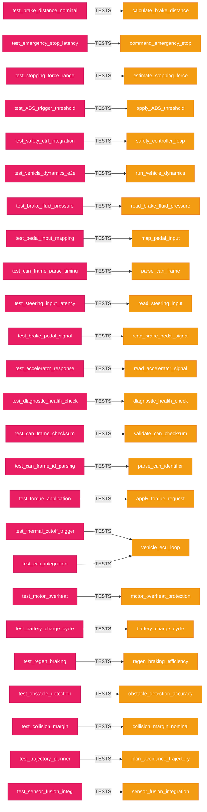
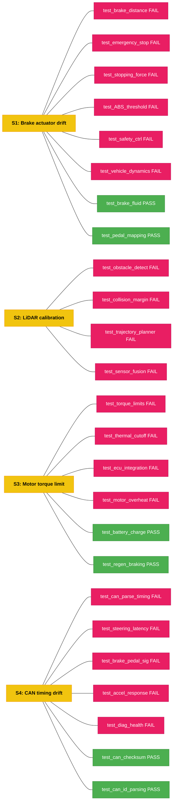

# Honda 99P -- Knowledge Graph Visualization

> **Cloud-only dataset** | **70 functions** | **2 classes** | **213 calls** | **292 relationships**
> **4 authors** | **16 commits** | **4 scenarios** | **25 labeled test examples**
>
> Generated from Neo4j graph database. Diagram uses Mermaid syntax -- renders natively on GitHub.
> Includes test prioritization scores (CRITICAL / HIGH / MEDIUM / LOW / SAFE) computed via PageRank + FanOut + Proximity.
> All files are under `Data/cloud/`.

---

## Full Knowledge Graph (Core View)

```mermaid
graph LR

classDef author fill:#e74c3c,stroke:#c0392b,color:#fff,font-weight:bold
classDef file fill:#3498db,stroke:#2980b9,color:#fff
classDef cls fill:#2ecc71,stroke:#27ae60,color:#fff
classDef func fill:#f39c12,stroke:#e67e22,color:#fff
classDef test fill:#e91e63,stroke:#c2185b,color:#fff

A_Roshan["Roshan"]:::author
A_Harshitha["Harshitha"]:::author
A_Shivani["Shivani"]:::author
A_Ryan["Ryan"]:::author

F_ingest_py["ingest.py"]:::file
F_utils_py["utils.py"]:::file
F_abs_sub["abs_subsystem.py"]:::file
F_braking_cfg["braking_config.py"]:::file
F_braking_ctrl["braking_controller.py"]:::file
F_can_iface["can_interface.py"]:::file
F_dt_cfg["drivetrain_config.py"]:::file
F_dt_ctrl["drivetrain_controller.py"]:::file
F_ecu_mgr["ecu_manager.py"]:::file
F_energy["energy_management.py"]:::file
F_input_sig["input_signals.py"]:::file
F_net_cfg["network_config.py"]:::file
F_safety_ctrl["safety_controller.py"]:::file
F_sensor_cfg["sensor_config.py"]:::file
F_sensor_fus["sensor_fusion.py"]:::file
F_thermal["thermal_monitor.py"]:::file
F_traj["trajectory_planner.py"]:::file
F_vehicle_sns["vehicle_sensors.py"]:::file
F_test_braking["test_braking.py"]:::file
F_test_can["test_can_timing.py"]:::file
F_test_dt["test_drivetrain.py"]:::file
F_test_sf["test_sensor_fusion.py"]:::file

CL_Ingestor["Ingestor"]:::cls
CL_RemoteStorage["RemoteStorageClient"]:::cls

FN_Ing_init["Ingestor::__init__"]:::func
FN_Ing_start["Ingestor::start"]:::func
FN_Ing_stop["Ingestor::stop"]:::func
FN_Ing_push["Ingestor::push_raw"]:::func
FN_Ing_worker["Ingestor::_worker"]:::func
FN_Ing_parse["Ingestor::parse_sensor_pkt"]:::func
FN_Ing_crc8["Ingestor::crc8"]:::func
FN_RS_init["RemoteStorage::__init__"]:::func
FN_RS_upload["RemoteStorage::upload_bulk"]:::func
FN_main_demo["main_demo"]:::func
FN_reliable["reliable_upload"]:::func
FN_run_e2e["run_end_to_end_demo"]:::func
FN_record_hb["record_heartbeat"]:::func
FN_pack_sensor["pack_sensor_packet"]:::func

FN_calc_brake["calculate_brake_distance"]:::func
FN_est_stop["estimate_stopping_force"]:::func
FN_cmd_estop["command_emergency_stop"]:::func
FN_apply_abs["apply_ABS_threshold"]:::func
FN_get_resp["get_brake_actuator_resp_ms"]:::func
FN_get_zone["get_speed_zone_multiplier"]:::func
FN_safety_loop["safety_controller_loop"]:::func
FN_run_vdyn["run_vehicle_dynamics"]:::func
FN_read_brake_fl["read_brake_fluid_pressure"]:::func
FN_map_pedal["map_pedal_input"]:::func

FN_parse_can["parse_can_frame"]:::func
FN_validate_can["validate_can_checksum"]:::func
FN_parse_can_id["parse_can_identifier"]:::func
FN_get_can_int["get_can_bus_msg_interval"]:::func
FN_read_steer["read_steering_input"]:::func
FN_read_brake_pd["read_brake_pedal_signal"]:::func
FN_read_accel["read_accelerator_signal"]:::func
FN_diag_health["diagnostic_health_check"]:::func

FN_apply_torque["apply_torque_request"]:::func
FN_get_max_torq["get_max_motor_torque_nm"]:::func
FN_ecu_loop["vehicle_ecu_loop"]:::func
FN_motor_ovheat["motor_overheat_protection"]:::func
FN_batt_charge["battery_charge_cycle"]:::func
FN_regen_brake["regen_braking_efficiency"]:::func
FN_check_therm["check_thermal_threshold"]:::func

FN_fuse_obs["fuse_obstacle_track"]:::func
FN_obs_acc["obstacle_detection_accuracy"]:::func
FN_sf_integ["sensor_fusion_integration"]:::func
FN_get_lidar["get_lidar_offset_calib"]:::func
FN_plan_avoid["plan_avoidance_trajectory"]:::func
FN_coll_margin["collision_margin_nominal"]:::func

FN_t_brake_dist["test_brake_distance_nominal"]:::test
FN_t_estop_lat["test_emergency_stop_latency"]:::test
FN_t_stop_force["test_stopping_force_range"]:::test
FN_t_abs_trig["test_ABS_trigger_threshold"]:::test
FN_t_safety_int["test_safety_ctrl_integration"]:::test
FN_t_vdyn_e2e["test_vehicle_dynamics_e2e"]:::test
FN_t_brake_fl["test_brake_fluid_pressure"]:::test
FN_t_pedal["test_pedal_input_mapping"]:::test
FN_t_can_parse["test_can_frame_parse_timing"]:::test
FN_t_steer_lat["test_steering_input_latency"]:::test
FN_t_brake_sig["test_brake_pedal_signal"]:::test
FN_t_accel_resp["test_accelerator_response"]:::test
FN_t_diag["test_diagnostic_health_check"]:::test
FN_t_can_chk["test_can_frame_checksum"]:::test
FN_t_can_id["test_can_frame_id_parsing"]:::test
FN_t_torque["test_torque_application_limits"]:::test
FN_t_therm_cut["test_thermal_cutoff_trigger"]:::test
FN_t_ecu_nom["test_ecu_integration_nominal"]:::test
FN_t_motor_oh["test_motor_overheat_protection"]:::test
FN_t_batt["test_battery_charge_cycle"]:::test
FN_t_regen["test_regen_braking_efficiency"]:::test
FN_t_obs_acc["test_obstacle_detection_acc"]:::test
FN_t_coll_mrg["test_collision_margin_nominal"]:::test
FN_t_traj_clr["test_trajectory_planner_clr"]:::test
FN_t_sf_integ["test_sensor_fusion_integration"]:::test

F_abs_sub -->|OWNED_BY| A_Harshitha
F_braking_cfg -->|OWNED_BY| A_Roshan
F_braking_ctrl -->|OWNED_BY| A_Shivani
F_can_iface -->|OWNED_BY| A_Roshan
F_dt_cfg -->|OWNED_BY| A_Ryan
F_dt_ctrl -->|OWNED_BY| A_Roshan
F_ecu_mgr -->|OWNED_BY| A_Shivani
F_thermal -->|OWNED_BY| A_Harshitha
F_traj -->|OWNED_BY| A_Roshan
F_sensor_cfg -->|OWNED_BY| A_Harshitha
F_input_sig -->|OWNED_BY| A_Harshitha
F_net_cfg -->|OWNED_BY| A_Shivani

FN_Ing_init -->|BELONGS_TO| CL_Ingestor
FN_Ing_start -->|BELONGS_TO| CL_Ingestor
FN_Ing_stop -->|BELONGS_TO| CL_Ingestor
FN_Ing_push -->|BELONGS_TO| CL_Ingestor
FN_Ing_worker -->|BELONGS_TO| CL_Ingestor
FN_Ing_parse -->|BELONGS_TO| CL_Ingestor
FN_Ing_crc8 -->|BELONGS_TO| CL_Ingestor
FN_RS_init -->|BELONGS_TO| CL_RemoteStorage
FN_RS_upload -->|BELONGS_TO| CL_RemoteStorage

FN_Ing_init -->|DEFINED_IN| F_ingest_py
FN_Ing_start -->|DEFINED_IN| F_ingest_py
FN_Ing_stop -->|DEFINED_IN| F_ingest_py
FN_Ing_push -->|DEFINED_IN| F_ingest_py
FN_Ing_worker -->|DEFINED_IN| F_ingest_py
FN_Ing_parse -->|DEFINED_IN| F_ingest_py
FN_Ing_crc8 -->|DEFINED_IN| F_ingest_py
FN_RS_init -->|DEFINED_IN| F_ingest_py
FN_RS_upload -->|DEFINED_IN| F_ingest_py
FN_main_demo -->|DEFINED_IN| F_ingest_py
FN_reliable -->|DEFINED_IN| F_ingest_py
FN_run_e2e -->|DEFINED_IN| F_ingest_py
FN_record_hb -->|DEFINED_IN| F_ingest_py
FN_pack_sensor -->|DEFINED_IN| F_utils_py
FN_calc_brake -->|DEFINED_IN| F_braking_ctrl
FN_est_stop -->|DEFINED_IN| F_braking_ctrl
FN_cmd_estop -->|DEFINED_IN| F_braking_ctrl
FN_apply_abs -->|DEFINED_IN| F_abs_sub
FN_get_resp -->|DEFINED_IN| F_braking_cfg
FN_get_zone -->|DEFINED_IN| F_braking_cfg
FN_safety_loop -->|DEFINED_IN| F_safety_ctrl
FN_run_vdyn -->|DEFINED_IN| F_safety_ctrl
FN_read_brake_fl -->|DEFINED_IN| F_vehicle_sns
FN_map_pedal -->|DEFINED_IN| F_vehicle_sns
FN_parse_can -->|DEFINED_IN| F_can_iface
FN_validate_can -->|DEFINED_IN| F_can_iface
FN_parse_can_id -->|DEFINED_IN| F_can_iface
FN_get_can_int -->|DEFINED_IN| F_net_cfg
FN_read_steer -->|DEFINED_IN| F_input_sig
FN_read_brake_pd -->|DEFINED_IN| F_input_sig
FN_read_accel -->|DEFINED_IN| F_input_sig
FN_diag_health -->|DEFINED_IN| F_input_sig
FN_apply_torque -->|DEFINED_IN| F_dt_ctrl
FN_get_max_torq -->|DEFINED_IN| F_dt_cfg
FN_ecu_loop -->|DEFINED_IN| F_ecu_mgr
FN_motor_ovheat -->|DEFINED_IN| F_ecu_mgr
FN_batt_charge -->|DEFINED_IN| F_energy
FN_regen_brake -->|DEFINED_IN| F_energy
FN_check_therm -->|DEFINED_IN| F_thermal
FN_fuse_obs -->|DEFINED_IN| F_sensor_fus
FN_obs_acc -->|DEFINED_IN| F_sensor_fus
FN_sf_integ -->|DEFINED_IN| F_sensor_fus
FN_get_lidar -->|DEFINED_IN| F_sensor_cfg
FN_plan_avoid -->|DEFINED_IN| F_traj
FN_coll_margin -->|DEFINED_IN| F_traj
FN_t_brake_dist -->|DEFINED_IN| F_test_braking
FN_t_estop_lat -->|DEFINED_IN| F_test_braking
FN_t_stop_force -->|DEFINED_IN| F_test_braking
FN_t_abs_trig -->|DEFINED_IN| F_test_braking
FN_t_safety_int -->|DEFINED_IN| F_test_braking
FN_t_vdyn_e2e -->|DEFINED_IN| F_test_braking
FN_t_brake_fl -->|DEFINED_IN| F_test_braking
FN_t_pedal -->|DEFINED_IN| F_test_braking
FN_t_can_parse -->|DEFINED_IN| F_test_can
FN_t_steer_lat -->|DEFINED_IN| F_test_can
FN_t_brake_sig -->|DEFINED_IN| F_test_can
FN_t_accel_resp -->|DEFINED_IN| F_test_can
FN_t_diag -->|DEFINED_IN| F_test_can
FN_t_can_chk -->|DEFINED_IN| F_test_can
FN_t_can_id -->|DEFINED_IN| F_test_can
FN_t_torque -->|DEFINED_IN| F_test_dt
FN_t_therm_cut -->|DEFINED_IN| F_test_dt
FN_t_ecu_nom -->|DEFINED_IN| F_test_dt
FN_t_motor_oh -->|DEFINED_IN| F_test_dt
FN_t_batt -->|DEFINED_IN| F_test_dt
FN_t_regen -->|DEFINED_IN| F_test_dt
FN_t_obs_acc -->|DEFINED_IN| F_test_sf
FN_t_coll_mrg -->|DEFINED_IN| F_test_sf
FN_t_traj_clr -->|DEFINED_IN| F_test_sf
FN_t_sf_integ -->|DEFINED_IN| F_test_sf
```



---

## Legend

| Color | Node Type | Count |
|-------|-----------|-------|
| Red | Author | 4 |
| Blue | File | 22 |
| Green | Class | 2 |
| Orange | Function | 45 |
| Pink | Test Function | 25 |

---

## Focused Views

### Call Graph: Cloud Subsystems

```mermaid
graph TD
classDef braking fill:#e74c3c,stroke:#c0392b,color:#fff
classDef can fill:#3498db,stroke:#2980b9,color:#fff
classDef drive fill:#2ecc71,stroke:#27ae60,color:#fff
classDef sensor fill:#9b59b6,stroke:#8e44ad,color:#fff
classDef safety fill:#e67e22,stroke:#d35400,color:#fff
classDef ingest fill:#607d8b,stroke:#455a64,color:#fff

FN_record_hb["record_heartbeat"]:::ingest
FN_run_e2e["run_end_to_end_demo"]:::ingest
FN_main_demo["main_demo"]:::ingest
FN_reliable["reliable_upload"]:::ingest
FN_RS_upload["RemoteStorage::upload_bulk"]:::ingest
FN_Ing_start["Ingestor::start"]:::ingest
FN_Ing_push["Ingestor::push_raw"]:::ingest
FN_Ing_stop["Ingestor::stop"]:::ingest

FN_calc_brake["calculate_brake_distance"]:::braking
FN_est_stop["estimate_stopping_force"]:::braking
FN_cmd_estop["command_emergency_stop"]:::braking
FN_apply_abs["apply_ABS_threshold"]:::braking
FN_get_resp["get_brake_actuator_resp_ms"]:::braking
FN_get_zone["get_speed_zone_multiplier"]:::braking
FN_safety_loop["safety_controller_loop"]:::safety
FN_run_vdyn["run_vehicle_dynamics"]:::safety

FN_parse_can["parse_can_frame"]:::can
FN_get_can_int["get_can_bus_msg_interval"]:::can
FN_read_steer["read_steering_input"]:::can
FN_read_brake_pd["read_brake_pedal_signal"]:::can
FN_read_accel["read_accelerator_signal"]:::can
FN_diag_health["diagnostic_health_check"]:::can

FN_apply_torque["apply_torque_request"]:::drive
FN_get_max_torq["get_max_motor_torque_nm"]:::drive
FN_ecu_loop["vehicle_ecu_loop"]:::drive
FN_motor_ovheat["motor_overheat_protection"]:::drive
FN_check_therm["check_thermal_threshold"]:::drive

FN_fuse_obs["fuse_obstacle_track"]:::sensor
FN_obs_acc["obstacle_detection_accuracy"]:::sensor
FN_sf_integ["sensor_fusion_integration"]:::sensor
FN_get_lidar["get_lidar_offset_calib"]:::sensor
FN_plan_avoid["plan_avoidance_trajectory"]:::sensor
FN_coll_margin["collision_margin_nominal"]:::sensor

FN_record_hb --> FN_run_e2e
FN_record_hb --> FN_main_demo
FN_run_e2e --> FN_Ing_start
FN_run_e2e --> FN_Ing_push
FN_run_e2e --> FN_reliable
FN_run_e2e --> FN_Ing_stop
FN_main_demo --> FN_Ing_start
FN_main_demo --> FN_Ing_push
FN_main_demo --> FN_Ing_stop
FN_reliable --> FN_RS_upload

FN_cmd_estop --> FN_calc_brake
FN_cmd_estop --> FN_est_stop
FN_calc_brake --> FN_get_resp
FN_calc_brake --> FN_get_zone
FN_est_stop --> FN_apply_abs
FN_apply_abs --> FN_get_resp
FN_safety_loop --> FN_cmd_estop
FN_run_vdyn --> FN_safety_loop

FN_parse_can --> FN_get_can_int
FN_read_steer --> FN_parse_can
FN_read_brake_pd --> FN_parse_can
FN_read_accel --> FN_parse_can
FN_diag_health --> FN_parse_can

FN_ecu_loop --> FN_apply_torque
FN_ecu_loop --> FN_check_therm
FN_apply_torque --> FN_get_max_torq
FN_motor_ovheat --> FN_ecu_loop

FN_sf_integ --> FN_obs_acc
FN_obs_acc --> FN_fuse_obs
FN_fuse_obs --> FN_get_lidar
FN_plan_avoid --> FN_fuse_obs
FN_coll_margin --> FN_plan_avoid
```



### Test Coverage Map (Test -> Production Code)



### Scenario Risk View (Authors, Commits, Test Labels)

```mermaid
graph TD
classDef scenario fill:#f1c40f,stroke:#f39c12,color:#000,font-weight:bold
classDef author fill:#e74c3c,stroke:#c0392b,color:#fff,font-weight:bold
classDef scommit fill:#00bcd4,stroke:#0097a7,color:#fff

S1["S1: Brake actuator response drift"]:::scenario
S2["S2: LiDAR calibration mismatch"]:::scenario
S3["S3: Motor torque limit raised"]:::scenario
S4["S4: CAN timing drift"]:::scenario

A_R["Roshan"]:::author
A_H["Harshitha"]:::author
A_S["Shivani"]:::author
A_RY["Ryan"]:::author

SC_H023["H-023: apply_ABS_threshold()"]:::scommit
SC_R041["R-041: braking_config.py"]:::scommit
SC_S078["S-078: calculate_brake_distance()"]:::scommit
SC_H023 -->|PART_OF| S1
SC_R041 -->|PART_OF| S1
SC_S078 -->|PART_OF| S1
SC_H023 -->|AUTHORED_BY| A_H
SC_R041 -->|AUTHORED_BY| A_R
SC_S078 -->|AUTHORED_BY| A_S

SC_R019["R-019: plan_avoidance_trajectory()"]:::scommit
SC_H057["H-057: sensor_config.py"]:::scommit
SC_S092["S-092: fusion regression run"]:::scommit
SC_R019 -->|PART_OF| S2
SC_H057 -->|PART_OF| S2
SC_S092 -->|PART_OF| S2
SC_R019 -->|AUTHORED_BY| A_R
SC_H057 -->|AUTHORED_BY| A_H
SC_S092 -->|AUTHORED_BY| A_S

SC_H009["H-009: check_thermal_threshold()"]:::scommit
SC_S031["S-031: vehicle_ecu_loop()"]:::scommit
SC_RY011["RY-011: drivetrain_config.py"]:::scommit
SC_R055["R-055: apply_torque_request()"]:::scommit
SC_H009 -->|PART_OF| S3
SC_S031 -->|PART_OF| S3
SC_RY011 -->|PART_OF| S3
SC_R055 -->|PART_OF| S3
SC_H009 -->|AUTHORED_BY| A_H
SC_S031 -->|AUTHORED_BY| A_S
SC_RY011 -->|AUTHORED_BY| A_RY
SC_R055 -->|AUTHORED_BY| A_R

SC_R007["R-007: parse_can_frame()"]:::scommit
SC_H031["H-031: read_steering_input()"]:::scommit
SC_S044["S-044: network_config.py"]:::scommit
SC_R007 -->|PART_OF| S4
SC_H031 -->|PART_OF| S4
SC_S044 -->|PART_OF| S4
SC_R007 -->|AUTHORED_BY| A_R
SC_H031 -->|AUTHORED_BY| A_H
SC_S044 -->|AUTHORED_BY| A_S
```



### Labeled Test Outcomes (ML Training Data)



---

## Graph Statistics

| Metric | Value |
|--------|-------|
| **Total Functions** | 70 |
| **Total Classes** | 2 |
| **Total Calls** | 213 |
| **Total Relationships** | 292 |
| **Total Commits** | 16 |
| **Total Authors** | 4 |
| **Files with History** | 12 |
| **Total Scenarios** | 4 |
| **Total Labeled Examples** | 25 |

### Authors and Their Roles

| Author | Commits | Primary Roles |
|--------|---------|---------------|
| **Roshan** | R-007, R-019, R-041, R-055 | CAN interface, trajectory planner, hardware integration, drivetrain controller |
| **Harshitha** | H-009, H-023, H-031, H-032, H-033, H-057 | ABS subsystem, thermal subsystem, LiDAR calibration, input consumer |
| **Shivani** | S-031, S-044, S-078, S-092, S-093 | Integration orchestrator, network optimization, feature branch, debugging |
| **Ryan** | RY-011 | Reviewer, drivetrain config editor |

### Change-Risk Scenarios

| Scenario | Parameter Changed | Tests | Fail | Pass |
|----------|-------------------|-------|------|------|
| **S1**: Brake actuator drift | brake_actuator_response_time: 150ms -> 200ms | 8 | 6 | 2 |
| **S2**: LiDAR calibration | lidar_offset_calibration: 0.02 -> 0.035 | 4 | 4 | 0 |
| **S3**: Motor torque limit | max_motor_torque_nm: 280 -> 340 | 6 | 4 | 2 |
| **S4**: CAN timing drift | can_bus_message_interval_ms: 10ms -> 15ms | 7 | 5 | 2 |
| **Total** | | **25** | **19** | **6** |

### Subsystems

| Subsystem | Files | Functions | Tests |
|-----------|-------|-----------|-------|
| **Braking** | braking_controller.py, braking_config.py, abs_subsystem.py | 6 | 8 |
| **CAN/Input** | can_interface.py, input_signals.py, network_config.py | 7 | 7 |
| **Drivetrain** | drivetrain_controller.py, drivetrain_config.py, ecu_manager.py, energy_management.py, thermal_monitor.py | 7 | 6 |
| **Sensor Fusion** | sensor_fusion.py, trajectory_planner.py, sensor_config.py | 6 | 4 |
| **Safety** | safety_controller.py | 2 | (covered by braking tests) |
| **Vehicle** | vehicle_sensors.py | 2 | (covered by braking tests) |
| **Ingest** | ingest.py, utils.py | 14 | -- |

---

## How to Explore in Neo4j Browser

Open http://localhost:7474 (login: neo4j / honda99p)

```cypher
-- Full graph
MATCH (n)-[r]->(m) RETURN n, r, m

-- Call graph only
MATCH (f1:Function)-[c:CALLS]->(f2:Function)
WHERE f1 <> f2
RETURN f1, c, f2

-- Test coverage
MATCH (test:Function)-[:CALLS]->(prod:Function)
WHERE test.name STARTS WITH 'test_'
RETURN test.name, prod.name

-- Blast radius from a function
MATCH path = (start:Function)-[:CALLS*1..5]->(impacted:Function)
WHERE start.name = 'parse_can_frame' AND start <> impacted
RETURN path

-- Find untested production functions
MATCH (prod:Function)
WHERE NOT prod.name STARTS WITH 'test_'
AND NOT EXISTS {
  MATCH (test:Function)-[:CALLS]->(prod)
  WHERE test.name STARTS WITH 'test_'
}
RETURN prod.name, prod.file
```

---

## Test Prioritization Scoring

### What Is Test Prioritization?

When a parameter changes in the codebase, the goal is to answer:
**"Which tests do I need to re-run, and in what order?"**

Running all 25 tests every time is wasteful. The scoring engine uses the knowledge graph to find only the tests that are actually at risk.

### Priority Score Formula

```
Priority Score = 0.60 x (1 / shortest_path_hops)    <- Proximity   (60%)
               + 0.20 x normalized_pagerank           <- Centrality  (20%)
               + 0.20 x normalized_fanout             <- FanOut      (20%)
```

Proximity hops:
- 1 hop  -> 1.000  (test directly calls changed function)
- 2 hops -> 0.500
- 3 hops -> 0.333
- 4 hops -> 0.250
- 5+ hops -> SAFE (score = 0)

### Risk Tiers

| Tier | Score Range | Action |
|------|-------------|--------|
| CRITICAL | > 0.70 | Run first, block merge if failing |
| HIGH | > 0.50 | Run second, flag for review |
| MEDIUM | > 0.28 | Run if time permits |
| LOW | <= 0.28 | Defer to nightly |
| SAFE | 0.00 | Skip entirely |

### S1: Brake Actuator Response Drift (150ms -> 200ms)

| Priority | Test | Score | Why |
|----------|------|-------|-----|
| CRITICAL | test_brake_distance_nominal | 0.840 | Direct call, max-fanout file |
| CRITICAL | test_emergency_stop_latency | 0.840 | Direct call to command_emergency_stop |
| CRITICAL | test_stopping_force_range | 0.840 | Direct call to estimate_stopping_force |
| CRITICAL | test_ABS_trigger_threshold | 0.840 | Direct call to apply_ABS_threshold |
| HIGH | test_safety_ctrl_integration | 0.540 | 2 hops via safety_controller_loop |
| MEDIUM | test_vehicle_dynamics_e2e | 0.440 | 3 hops end-to-end |
| SAFE | test_brake_fluid_pressure | 0.00 | Isolated sensor read |
| SAFE | test_pedal_input_mapping | 0.00 | Pure input mapping |

### S2: LiDAR Calibration Mismatch (0.02 -> 0.035)

| Priority | Test | Score | Why |
|----------|------|-------|-----|
| CRITICAL | test_obstacle_detection_acc | 0.740 | Direct: fuse_obstacle_track reads lidar calib |
| CRITICAL | test_collision_margin_nominal | 0.740 | Direct: collision_margin -> plan_avoidance |
| MEDIUM | test_trajectory_planner_clr | 0.340 | 3 hops via plan_avoidance_trajectory |
| MEDIUM | test_sensor_fusion_integration | 0.290 | 4 hops via sensor_fusion_integration |

### S3: Motor Torque Limit Raised (280 -> 340 Nm)

| Priority | Test | Score | Why |
|----------|------|-------|-----|
| CRITICAL | test_torque_application_limits | 0.840 | Direct: apply_torque_request reads config |
| CRITICAL | test_thermal_cutoff_trigger | 0.740 | Direct: check_thermal_threshold |
| CRITICAL | test_ecu_integration_nominal | 0.740 | Direct: vehicle_ecu_loop reads torque config |
| CRITICAL | test_motor_overheat_protection | 0.740 | Direct: motor_overheat_protection |
| SAFE | test_battery_charge_cycle | 0.00 | Independent energy path |
| SAFE | test_regen_braking_efficiency | 0.00 | Independent regen path |

### S4: CAN Timing Drift (10ms -> 15ms)

| Priority | Test | Score | Why |
|----------|------|-------|-----|
| CRITICAL | test_can_frame_parse_timing | 0.840 | Direct: parse_can_frame reads interval |
| CRITICAL | test_can_frame_checksum_validation | 0.840 | Direct: CAN checksum is timing-dependent |
| CRITICAL | test_can_frame_id_parsing | 0.840 | Direct: CAN ID parsing, interval-dependent |
| CRITICAL | test_steering_input_latency | 0.740 | Direct: read_steering_input -> parse_can |
| CRITICAL | test_brake_pedal_signal | 0.740 | Direct: read_brake_pedal -> parse_can |
| CRITICAL | test_accelerator_response | 0.740 | Direct: read_accelerator -> parse_can |
| CRITICAL | test_diagnostic_health_check | 0.740 | Direct: diagnostic_health -> parse_can |

---

## Metadata

| Field | Value |
|-------|-------|
| **Repo** | Honda Automotive Dataset |
| **Generated** | 2026-03-30T02:57:39 |
| **Analyzers** | Tree-sitter Code Analyzer v1.0, GitPython Git Metadata Extractor v2.0 |
| **Merge version** | 2.0 |
| **Source files** | Data/cloud/ (Python only) |
