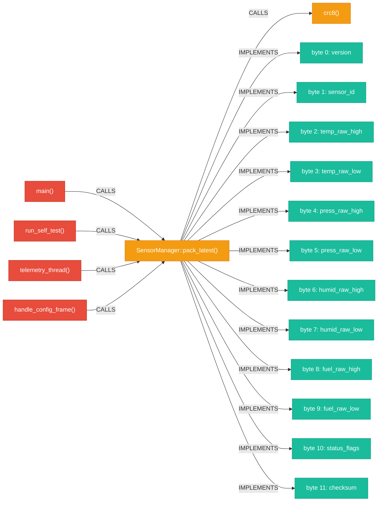

# Honda 99P — Knowledge Graph Visualization

> **82 nodes** | **192 relationships** | **6 node types** | **7 relationship types**
>
> Generated from Neo4j graph database. Diagram uses Mermaid syntax — renders natively on GitHub.

---

## Full Knowledge Graph

```mermaid
graph LR

%% ─── STYLES ───
classDef author fill:#e74c3c,stroke:#c0392b,color:#fff,font-weight:bold
classDef commit fill:#9b59b6,stroke:#8e44ad,color:#fff
classDef file fill:#3498db,stroke:#2980b9,color:#fff
classDef cls fill:#2ecc71,stroke:#27ae60,color:#fff
classDef func fill:#f39c12,stroke:#e67e22,color:#fff
classDef hsi fill:#1abc9c,stroke:#16a085,color:#fff

%% ─── AUTHOR ───
A_RM["👤 Roshan Muddaluru"]:::author

%% ─── COMMITS ───
C_50520b2["🔹 50520b2"]:::commit
C_743413c["🔹 743413c"]:::commit
C_77e58e7["🔹 77e58e7"]:::commit
C_aba3ae8["🔹 aba3ae8"]:::commit
C_da424f5["🔹 da424f5"]:::commit

%% ─── FILES ───
F_canbus_cpp["📄 canbus.cpp"]:::file
F_canbus_h["📄 canbus.h"]:::file
F_gps_cpp["📄 gps.cpp"]:::file
F_gps_h["📄 gps.h"]:::file
F_interrupts_cpp["📄 interrupts.cpp"]:::file
F_interrupts_h["📄 interrupts.h"]:::file
F_main_cpp["📄 main.cpp"]:::file
F_sensors_cpp["📄 sensors.cpp"]:::file
F_sensors_h["📄 sensors.h"]:::file
F_ingest_py["📄 ingest.py"]:::file
F_utils_py["📄 utils.py"]:::file
F_hsi_md["📄 hsi.md"]:::file
F_run_demo["📄 run_demo.sh"]:::file
F_run_tests["📄 run_tests.sh"]:::file
F_data_readme["📄 Data/README.md"]:::file
F_readme["📄 README.md"]:::file
F_git_parser["📄 git_parser.py"]:::file
F_requirements["📄 requirements.txt"]:::file

%% ─── CLASSES ───
CL_CANBus["🔷 CANBus"]:::cls
CL_GPSModule["🔷 GPSModule"]:::cls
CL_GPSFix["🔷 GPSFix"]:::cls
CL_SensorManager["🔷 SensorManager"]:::cls
CL_InterruptCtrl["🔷 InterruptController"]:::cls
CL_Ingestor["🔷 Ingestor"]:::cls
CL_RemoteStorage["🔷 RemoteStorageClient"]:::cls

%% ─── FUNCTIONS: firmware/canbus.cpp ───
FN_CB_init["⚙ CANBus::init"]:::func
FN_CB_send["⚙ CANBus::send"]:::func
FN_CB_send_id["⚙ CANBus::send_with_id"]:::func
FN_CB_receive["⚙ CANBus::receive"]:::func
FN_CB_extract["⚙ CANBus::extract_id"]:::func
FN_CB_inject["⚙ CANBus::inject_frame"]:::func
FN_CB_set_tx["⚙ CANBus::set_tx_id"]:::func

%% ─── FUNCTIONS: firmware/gps.cpp ───
FN_GPS_init["⚙ GPSModule::init"]:::func
FN_GPS_read["⚙ GPSModule::read_fix"]:::func
FN_GPS_nmea["⚙ GPSModule::nmea_from_fix"]:::func

%% ─── FUNCTIONS: firmware/sensors.cpp ───
FN_SM_init["⚙ SensorManager::init"]:::func
FN_SM_pack["⚙ SensorManager::pack_latest"]:::func
FN_SM_adc["⚙ SensorManager::on_adc_complete"]:::func
FN_SM_rate["⚙ SensorManager::set_sampling_rate_hz"]:::func
FN_SM_faultP["⚙ SM::inject_fault_pressure"]:::func
FN_SM_faultT["⚙ SM::inject_fault_temperature"]:::func
FN_crc8["⚙ crc8"]:::func

%% ─── FUNCTIONS: firmware/interrupts.cpp ───
FN_IC_init["⚙ InterruptCtrl::init"]:::func
FN_IC_raise["⚙ InterruptCtrl::raise"]:::func
FN_IC_register["⚙ InterruptCtrl::register_handler"]:::func

%% ─── FUNCTIONS: firmware/main.cpp ───
FN_main["⚙ main"]:::func
FN_run_self["⚙ run_self_test"]:::func
FN_telem["⚙ telemetry_thread"]:::func
FN_handle_cfg["⚙ handle_config_frame"]:::func
FN_print_hex["⚙ print_hex"]:::func

%% ─── FUNCTIONS: cloud/ingest.py ───
FN_Ing_init["⚙ Ingestor::__init__"]:::func
FN_Ing_worker["⚙ Ingestor::_worker"]:::func
FN_Ing_crc8["⚙ Ingestor::crc8"]:::func
FN_Ing_parse["⚙ Ingestor::parse_sensor_packet"]:::func
FN_Ing_push["⚙ Ingestor::push_raw"]:::func
FN_Ing_start["⚙ Ingestor::start"]:::func
FN_Ing_stop["⚙ Ingestor::stop"]:::func
FN_RS_init["⚙ RemoteStorage::__init__"]:::func
FN_RS_upload["⚙ RemoteStorage::upload_bulk"]:::func
FN_main_demo["⚙ main_demo"]:::func
FN_record_hb["⚙ record_heartbeat"]:::func
FN_reliable["⚙ reliable_upload"]:::func
FN_run_e2e["⚙ run_end_to_end_demo"]:::func

%% ─── FUNCTIONS: cloud/utils.py ───
FN_pack_sensor["⚙ pack_sensor_packet"]:::func

%% ─── HSI FIELDS ───
HSI_ver["🔸 version"]:::hsi
HSI_sid["🔸 sensor_id"]:::hsi
HSI_temp_h["🔸 temp_raw_high"]:::hsi
HSI_temp_l["🔸 temp_raw_low"]:::hsi
HSI_pres_h["🔸 press_raw_high"]:::hsi
HSI_pres_l["🔸 press_raw_low"]:::hsi
HSI_hum_h["🔸 humid_raw_high"]:::hsi
HSI_hum_l["🔸 humid_raw_low"]:::hsi
HSI_fuel_h["🔸 fuel_raw_high"]:::hsi
HSI_fuel_l["🔸 fuel_raw_low"]:::hsi
HSI_status["🔸 status_flags"]:::hsi
HSI_crc["🔸 checksum"]:::hsi

%% ═══════════════════════════════
%% ─── COMMITTED ───
A_RM -->|COMMITTED| C_50520b2
A_RM -->|COMMITTED| C_743413c
A_RM -->|COMMITTED| C_77e58e7
A_RM -->|COMMITTED| C_aba3ae8
A_RM -->|COMMITTED| C_da424f5

%% ─── CONTRIBUTED_TO (author → file) ───
A_RM -->|CONTRIBUTED_TO| F_canbus_cpp
A_RM -->|CONTRIBUTED_TO| F_canbus_h
A_RM -->|CONTRIBUTED_TO| F_gps_cpp
A_RM -->|CONTRIBUTED_TO| F_gps_h
A_RM -->|CONTRIBUTED_TO| F_interrupts_cpp
A_RM -->|CONTRIBUTED_TO| F_interrupts_h
A_RM -->|CONTRIBUTED_TO| F_main_cpp
A_RM -->|CONTRIBUTED_TO| F_sensors_cpp
A_RM -->|CONTRIBUTED_TO| F_sensors_h
A_RM -->|CONTRIBUTED_TO| F_ingest_py
A_RM -->|CONTRIBUTED_TO| F_utils_py
A_RM -->|CONTRIBUTED_TO| F_hsi_md
A_RM -->|CONTRIBUTED_TO| F_run_demo
A_RM -->|CONTRIBUTED_TO| F_run_tests
A_RM -->|CONTRIBUTED_TO| F_data_readme
A_RM -->|CONTRIBUTED_TO| F_readme
A_RM -->|CONTRIBUTED_TO| F_git_parser
A_RM -->|CONTRIBUTED_TO| F_requirements

%% ─── OWNED_BY (file → author) ───
F_canbus_cpp -->|OWNED_BY| A_RM
F_canbus_h -->|OWNED_BY| A_RM
F_gps_cpp -->|OWNED_BY| A_RM
F_gps_h -->|OWNED_BY| A_RM
F_interrupts_cpp -->|OWNED_BY| A_RM
F_interrupts_h -->|OWNED_BY| A_RM
F_main_cpp -->|OWNED_BY| A_RM
F_sensors_cpp -->|OWNED_BY| A_RM
F_sensors_h -->|OWNED_BY| A_RM
F_ingest_py -->|OWNED_BY| A_RM
F_utils_py -->|OWNED_BY| A_RM
F_hsi_md -->|OWNED_BY| A_RM
F_run_demo -->|OWNED_BY| A_RM
F_run_tests -->|OWNED_BY| A_RM
F_data_readme -->|OWNED_BY| A_RM
F_readme -->|OWNED_BY| A_RM
F_git_parser -->|OWNED_BY| A_RM
F_requirements -->|OWNED_BY| A_RM

%% ─── DEFINED_IN (function → file) ───
FN_CB_init -->|DEFINED_IN| F_canbus_cpp
FN_CB_send -->|DEFINED_IN| F_canbus_cpp
FN_CB_send_id -->|DEFINED_IN| F_canbus_cpp
FN_CB_receive -->|DEFINED_IN| F_canbus_cpp
FN_CB_extract -->|DEFINED_IN| F_canbus_cpp
FN_CB_inject -->|DEFINED_IN| F_canbus_cpp
FN_CB_set_tx -->|DEFINED_IN| F_canbus_cpp
FN_GPS_init -->|DEFINED_IN| F_gps_cpp
FN_GPS_read -->|DEFINED_IN| F_gps_cpp
FN_GPS_nmea -->|DEFINED_IN| F_gps_cpp
FN_SM_init -->|DEFINED_IN| F_sensors_cpp
FN_SM_pack -->|DEFINED_IN| F_sensors_cpp
FN_SM_adc -->|DEFINED_IN| F_sensors_cpp
FN_SM_rate -->|DEFINED_IN| F_sensors_cpp
FN_SM_faultP -->|DEFINED_IN| F_sensors_cpp
FN_SM_faultT -->|DEFINED_IN| F_sensors_cpp
FN_crc8 -->|DEFINED_IN| F_sensors_cpp
FN_IC_init -->|DEFINED_IN| F_interrupts_cpp
FN_IC_raise -->|DEFINED_IN| F_interrupts_cpp
FN_IC_register -->|DEFINED_IN| F_interrupts_cpp
FN_main -->|DEFINED_IN| F_main_cpp
FN_run_self -->|DEFINED_IN| F_main_cpp
FN_telem -->|DEFINED_IN| F_main_cpp
FN_handle_cfg -->|DEFINED_IN| F_main_cpp
FN_print_hex -->|DEFINED_IN| F_main_cpp
FN_Ing_init -->|DEFINED_IN| F_ingest_py
FN_Ing_worker -->|DEFINED_IN| F_ingest_py
FN_Ing_crc8 -->|DEFINED_IN| F_ingest_py
FN_Ing_parse -->|DEFINED_IN| F_ingest_py
FN_Ing_push -->|DEFINED_IN| F_ingest_py
FN_Ing_start -->|DEFINED_IN| F_ingest_py
FN_Ing_stop -->|DEFINED_IN| F_ingest_py
FN_RS_init -->|DEFINED_IN| F_ingest_py
FN_RS_upload -->|DEFINED_IN| F_ingest_py
FN_main_demo -->|DEFINED_IN| F_ingest_py
FN_record_hb -->|DEFINED_IN| F_ingest_py
FN_reliable -->|DEFINED_IN| F_ingest_py
FN_run_e2e -->|DEFINED_IN| F_ingest_py
FN_pack_sensor -->|DEFINED_IN| F_utils_py

%% ─── BELONGS_TO (function → class) ───
FN_CB_init -->|BELONGS_TO| CL_CANBus
FN_CB_send -->|BELONGS_TO| CL_CANBus
FN_CB_send_id -->|BELONGS_TO| CL_CANBus
FN_CB_receive -->|BELONGS_TO| CL_CANBus
FN_CB_extract -->|BELONGS_TO| CL_CANBus
FN_CB_inject -->|BELONGS_TO| CL_CANBus
FN_CB_set_tx -->|BELONGS_TO| CL_CANBus
FN_GPS_init -->|BELONGS_TO| CL_GPSModule
FN_GPS_read -->|BELONGS_TO| CL_GPSModule
FN_GPS_nmea -->|BELONGS_TO| CL_GPSModule
FN_SM_init -->|BELONGS_TO| CL_SensorManager
FN_SM_pack -->|BELONGS_TO| CL_SensorManager
FN_SM_adc -->|BELONGS_TO| CL_SensorManager
FN_SM_rate -->|BELONGS_TO| CL_SensorManager
FN_SM_faultP -->|BELONGS_TO| CL_SensorManager
FN_SM_faultT -->|BELONGS_TO| CL_SensorManager
FN_IC_init -->|BELONGS_TO| CL_InterruptCtrl
FN_IC_raise -->|BELONGS_TO| CL_InterruptCtrl
FN_IC_register -->|BELONGS_TO| CL_InterruptCtrl
FN_Ing_init -->|BELONGS_TO| CL_Ingestor
FN_Ing_worker -->|BELONGS_TO| CL_Ingestor
FN_Ing_crc8 -->|BELONGS_TO| CL_Ingestor
FN_Ing_parse -->|BELONGS_TO| CL_Ingestor
FN_Ing_push -->|BELONGS_TO| CL_Ingestor
FN_Ing_start -->|BELONGS_TO| CL_Ingestor
FN_Ing_stop -->|BELONGS_TO| CL_Ingestor
FN_RS_init -->|BELONGS_TO| CL_RemoteStorage
FN_RS_upload -->|BELONGS_TO| CL_RemoteStorage

%% ─── CALLS (function → function, excluding self-calls) ───
FN_Ing_init -->|CALLS| FN_RS_init
FN_Ing_worker -->|CALLS| FN_Ing_parse
FN_Ing_crc8 -->|CALLS| FN_crc8
FN_SM_pack -->|CALLS| FN_crc8
FN_handle_cfg -->|CALLS| FN_SM_rate
FN_handle_cfg -->|CALLS| FN_SM_pack
FN_handle_cfg -->|CALLS| FN_CB_send
FN_main -->|CALLS| FN_GPS_init
FN_main -->|CALLS| FN_CB_set_tx
FN_main -->|CALLS| FN_IC_register
FN_main -->|CALLS| FN_SM_adc
FN_main -->|CALLS| FN_CB_receive
FN_main -->|CALLS| FN_CB_extract
FN_main -->|CALLS| FN_SM_rate
FN_main -->|CALLS| FN_CB_send_id
FN_main -->|CALLS| FN_IC_raise
FN_main -->|CALLS| FN_CB_inject
FN_main -->|CALLS| FN_run_self
FN_main -->|CALLS| FN_SM_pack
FN_main -->|CALLS| FN_CB_send
FN_main_demo -->|CALLS| FN_Ing_start
FN_main_demo -->|CALLS| FN_Ing_push
FN_main_demo -->|CALLS| FN_Ing_stop
FN_record_hb -->|CALLS| FN_run_e2e
FN_record_hb -->|CALLS| FN_main_demo
FN_reliable -->|CALLS| FN_RS_upload
FN_run_e2e -->|CALLS| FN_Ing_start
FN_run_e2e -->|CALLS| FN_Ing_push
FN_run_e2e -->|CALLS| FN_reliable
FN_run_e2e -->|CALLS| FN_Ing_stop
FN_run_self -->|CALLS| FN_SM_adc
FN_run_self -->|CALLS| FN_SM_pack
FN_run_self -->|CALLS| FN_CB_send
FN_telem -->|CALLS| FN_SM_pack
FN_telem -->|CALLS| FN_CB_send

%% ─── IMPLEMENTS_HSI (function → HSI field) ───
FN_SM_pack -->|IMPLEMENTS_HSI| HSI_ver
FN_SM_pack -->|IMPLEMENTS_HSI| HSI_sid
FN_SM_pack -->|IMPLEMENTS_HSI| HSI_temp_h
FN_SM_pack -->|IMPLEMENTS_HSI| HSI_temp_l
FN_SM_pack -->|IMPLEMENTS_HSI| HSI_pres_h
FN_SM_pack -->|IMPLEMENTS_HSI| HSI_pres_l
FN_SM_pack -->|IMPLEMENTS_HSI| HSI_hum_h
FN_SM_pack -->|IMPLEMENTS_HSI| HSI_hum_l
FN_SM_pack -->|IMPLEMENTS_HSI| HSI_fuel_h
FN_SM_pack -->|IMPLEMENTS_HSI| HSI_fuel_l
FN_SM_pack -->|IMPLEMENTS_HSI| HSI_status
FN_SM_pack -->|IMPLEMENTS_HSI| HSI_crc
```



---

## Legend

| Color | Icon | Node Type | Count |
|-------|------|-----------|-------|
| 🔴 Red | 👤 | **Author** | 1 |
| 🟣 Purple | 🔹 | **Commit** | 5 |
| 🔵 Blue | 📄 | **File** | 18 |
| 🟢 Green | 🔷 | **Class** | 7 |
| 🟠 Orange | ⚙ | **Function** | 39 |
| 🟢 Teal | 🔸 | **HSIField** | 12 |

---

## Focused Views

### Call Graph Only (Functions → Functions)

Shows only the non-trivial call relationships between distinct functions:

```mermaid
graph TD
classDef firmware fill:#f39c12,stroke:#e67e22,color:#fff
classDef cloud fill:#3498db,stroke:#2980b9,color:#fff

%% Firmware functions
FN_main["main"]:::firmware
FN_run_self["run_self_test"]:::firmware
FN_telem["telemetry_thread"]:::firmware
FN_handle_cfg["handle_config_frame"]:::firmware
FN_SM_pack["SM::pack_latest"]:::firmware
FN_SM_adc["SM::on_adc_complete"]:::firmware
FN_SM_rate["SM::set_sampling_rate_hz"]:::firmware
FN_crc8["crc8"]:::firmware
FN_CB_send["CB::send"]:::firmware
FN_CB_send_id["CB::send_with_id"]:::firmware
FN_CB_receive["CB::receive"]:::firmware
FN_CB_extract["CB::extract_id"]:::firmware
FN_CB_inject["CB::inject_frame"]:::firmware
FN_CB_set_tx["CB::set_tx_id"]:::firmware
FN_GPS_init["GPS::init"]:::firmware
FN_IC_register["IC::register_handler"]:::firmware
FN_IC_raise["IC::raise"]:::firmware

%% Cloud functions
FN_Ing_init["Ingestor::__init__"]:::cloud
FN_Ing_worker["Ingestor::_worker"]:::cloud
FN_Ing_crc8["Ingestor::crc8"]:::cloud
FN_Ing_parse["Ingestor::parse_sensor_packet"]:::cloud
FN_Ing_push["Ingestor::push_raw"]:::cloud
FN_Ing_start["Ingestor::start"]:::cloud
FN_Ing_stop["Ingestor::stop"]:::cloud
FN_RS_init["RemoteStorage::__init__"]:::cloud
FN_RS_upload["RemoteStorage::upload_bulk"]:::cloud
FN_main_demo["main_demo"]:::cloud
FN_record_hb["record_heartbeat"]:::cloud
FN_reliable["reliable_upload"]:::cloud
FN_run_e2e["run_end_to_end_demo"]:::cloud

%% main() call tree
FN_main --> FN_GPS_init
FN_main --> FN_CB_set_tx
FN_main --> FN_IC_register
FN_main --> FN_SM_adc
FN_main --> FN_CB_receive
FN_main --> FN_CB_extract
FN_main --> FN_SM_rate
FN_main --> FN_CB_send_id
FN_main --> FN_IC_raise
FN_main --> FN_CB_inject
FN_main --> FN_run_self
FN_main --> FN_SM_pack
FN_main --> FN_CB_send

%% run_self_test
FN_run_self --> FN_SM_adc
FN_run_self --> FN_SM_pack
FN_run_self --> FN_CB_send

%% telemetry_thread
FN_telem --> FN_SM_pack
FN_telem --> FN_CB_send

%% handle_config_frame
FN_handle_cfg --> FN_SM_rate
FN_handle_cfg --> FN_SM_pack
FN_handle_cfg --> FN_CB_send

%% pack_latest → crc8
FN_SM_pack --> FN_crc8

%% Cloud call tree
FN_Ing_init --> FN_RS_init
FN_Ing_worker --> FN_Ing_parse
FN_Ing_crc8 --> FN_crc8
FN_main_demo --> FN_Ing_start
FN_main_demo --> FN_Ing_push
FN_main_demo --> FN_Ing_stop
FN_record_hb --> FN_run_e2e
FN_record_hb --> FN_main_demo
FN_reliable --> FN_RS_upload
FN_run_e2e --> FN_Ing_start
FN_run_e2e --> FN_Ing_push
FN_run_e2e --> FN_reliable
FN_run_e2e --> FN_Ing_stop
```



### HSI Traceability View

Shows the path from `main()` through `pack_latest` to all 12 SENSOR_PKT specification bytes:



---

## Graph Statistics

| Metric | Value |
|--------|-------|
| Total Nodes | 82 |
| Total Relationships | 192 |
| Function nodes | 39 |
| File nodes | 18 |
| HSIField nodes | 12 |
| Class nodes | 7 |
| Commit nodes | 5 |
| Author nodes | 1 |
| CALLS edges | 72 |
| DEFINED_IN edges | 39 |
| BELONGS_TO edges | 28 |
| OWNED_BY edges | 18 |
| CONTRIBUTED_TO edges | 18 |
| IMPLEMENTS_HSI edges | 12 |
| COMMITTED edges | 5 |

---

## How to Explore in Neo4j Browser

Open [http://localhost:7474](http://localhost:7474) (login: `neo4j` / `honda99p`)

```cypher
-- Full graph
MATCH (n)-[r]->(m) RETURN n, r, m

-- Call graph only
MATCH (f1:Function)-[c:CALLS]->(f2:Function)
WHERE f1 <> f2
RETURN f1, c, f2

-- HSI traceability
MATCH (f:Function)-[:IMPLEMENTS_HSI]->(h:HSIField)
RETURN f, h

-- Blast radius from a function
MATCH path = (start:Function)-[:CALLS*1..5]->(impacted:Function)
WHERE start.full_name = 'SensorManager::pack_latest' AND start <> impacted
RETURN path
```
